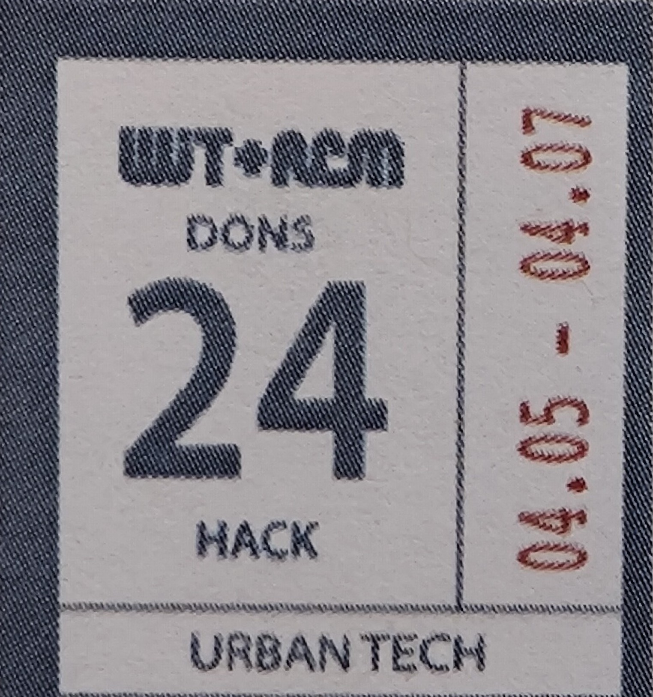

# Event Aggregator

## Description

Event Aggregator is a [brief description of your project].

## Features

- [Feature 1]
- [Feature 2]
- [Feature 3]

## Installation

To use Event Aggregator, follow these steps:

1. Clone the repository: `git clone https://github.com/taotien/event-aggregator.git`
2. [Additional installation steps, if any]

## Usage

[Instructions on how to use your project]

## Contributing

Contributions are welcome! Please follow these guidelines:

1. Fork the repository
2. Create a new branch: `git checkout -b feature/your-feature`
3. Commit your changes: `git commit -am 'Add some feature'`
4. Push to the branch: `git push origin feature/your-feature`
5. Submit a pull request

## License

[Specify the license for your project]

## Contact

[Provide contact information for questions or support]
